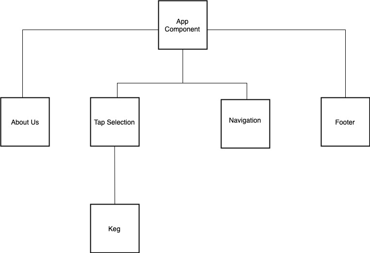

# _Taproom_

#### _A taproom located in my basement , 06/14/2019_

#### By _**Darrion Gering**_

## Description
_ My taproom's website, built with React.js_

## Setup/Installation Requirements

1. _Clone from GitHub_
2. _$type cd react-tap-room_
3. _$type npm install to install packages_
4. _$type npm run start to start and open the dev server_

## Specs

| Current Behaviors|
| ------------- |
| 1. Each keg has a name, brand, price, and alcohol content |
| 2. The program has a menu list of kegs |
| 3. An employee can fill out a form to add a new keg to the list |
| 4. An employee can edit a keg's properties |
| 5. A patron or an employee can see how many pints are left in a keg |
| 6. An employee can click a button when selling a pint, decreasing the total pints by 1 |
| 7. An employee knows when a keg has less than 10 pints left, to know when to replace it |
| 8. As a patron, all kegs should be color-coded for easy readability |
| 9. As a patron, I want to be able to sort by alcohol content |

# Wireframe

## Support and contact details

darrionkg@gmail.com

## Technologies Used

* Javascript
* html
* css
* react

### License

*MIT License*

Copyright (c) 2019 **_Darrion Gering_**